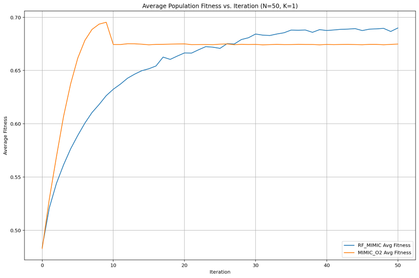
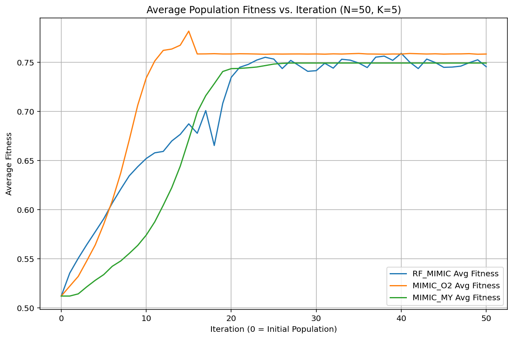

# FEDA Project: A Forest-guided Estimation of Distribution Algorithm for Optimization

This project focuses on the implementation and application of a **Forest-guided Estimation of Distribution Algorithm (FEDA)**, specifically an RF-MIMIC variant. This algorithm uses a Random Forest classifier to model the distribution of elite solutions and guide the sampling of new candidate solutions for complex optimization problems.

For comparative purposes, implementations of the **MIMIC (Mutual Information Maximizing Input Clustering)** algorithm (`MIMIC_O2` using a dependency tree, and `MIMIC_MY` using only marginal probabilities) are also included.

All algorithms are demonstrated by applying them to solve the NK-Landscape problem, a tunable rugged fitness landscape commonly used for benchmarking optimization algorithms.

## Core Algorithm: RF-MIMIC (Forest-guided EDA)

The primary algorithm in this project is the RF-MIMIC:
   - **Core Idea**: It maintains a population of candidate solutions. In each iteration, it selects elite individuals (the best-performing solutions) and trains a Random Forest (RF) classifier. This RF learns to distinguish the characteristics of these elite solutions from the non-elite ones. New, potentially better, solutions are then generated by probabilistically traversing the trees of the trained RF, effectively mimicking the properties of the high-performing individuals.
   - **Key Features**:
     - Leverages scikit-learn's `RandomForestClassifier` as its learning engine.
     - Employs a biased tree traversal mechanism, guided by elite sample distributions within the RF, for generating new candidate solutions.
     - Includes robust fallbacks for situations such as insufficient training data for the Random Forest.
   - **File**: `feda_algorithm/rf_mimic.py` (Class: `RF_MIMIC`)

## Comparative Algorithms

### MIMIC_O2
To provide a benchmark and explore alternative EDA approaches, a version of the MIMIC algorithm that builds a dependency tree is implemented:
   - **Core Idea**: Selects elite individuals and computes pairwise mutual information between variables (genes) within this elite set. It then constructs a dependency tree (approximating a Maximum Spanning Tree based on mutual information) representing the relationships between variables. New solutions are sampled sequentially based on this tree structure, using conditional probabilities derived from the elite samples.
   - **Key Features**:
     - Builds a probabilistic model based on first and second-order statistics (marginal and pairwise).
     - Uses a tree structure to capture dependencies.
     - Includes a diversity injection mechanism if the population converges prematurely.
   - **File**: `feda_algorithm/mimic_o2.py` (Class: `MIMIC_O2`)

### MIMIC_MY
A simpler variant of MIMIC is also included:
   - **Core Idea**: This version estimates only the marginal probabilities of each gene from the elite set and samples new individuals by assuming independence between genes.
   - **Key Features**:
     - Computationally very light.
     - Models only first-order statistics (no dependencies).
   - **File**: `feda_algorithm/mimic_my.py` (Class: `MIMIC_MY`)


## Project Structure

```
feda-project/
├── .gitignore
├── README.md
├── requirements.txt
├── images/                 # <--- Create this folder for your result images
│   ├── 50_1.png
│   ├── 50_5.png
│   ├── 50_10.png
│   └── 50_20.png
├── examples/
│   └── run_feda_nk.py        # Main script to run experiments and compare algorithms
├── feda_algorithm/
│   ├── init.py
│   ├── rf_mimic.py
│   ├── mimic_o2.py
│   └── mimic_my.py
├── problem_definitions/
│   ├── init.py
│   └── nk_landscape.py       # Defines the NK-Landscape problem
└── utils/
├── init.py
└── debugging.py          # Utility for debug printing
```

## Setup Instructions

### Prerequisites
* Python (e.g., Python 3.8+ recommended)
* `pip` (Python package installer)

### Installation
1.  **Clone the repository (if you haven't already):**
    ```bash
    git clone [https://github.com/tortawan/feda-project.git](https://github.com/tortawan/feda-project.git)
    cd feda-project
    ```

2.  **Create a virtual environment (recommended):**
    ```bash
    python -m venv venv
    ```
    Activate the virtual environment:
    * On Windows:
        ```bash
        .\venv\Scripts\activate
        ```
    * On macOS and Linux:
        ```bash
        source venv/bin/activate
        ```

3.  **Install dependencies:**
    Navigate to the project root directory (where `requirements.txt` is located) and run:
    ```bash
    pip install -r requirements.txt
    ```
    This will install `numpy`, `scikit-learn`, `matplotlib`, and `pytest` as specified in the `requirements.txt` file.

## How to Run the Examples

The primary script for running experiments is `examples/run_feda_nk.py`.

1.  **Navigate to the `examples` directory (or run from the root):**
    ```bash
    cd examples
    python run_feda_nk.py
    ```
    Or from the project root:
    ```bash
    python examples/run_feda_nk.py
    ```

2.  **Understanding `run_feda_nk.py`:**
    * This script is configured to run the primary `RF_MIMIC` algorithm and the comparative `MIMIC_O2` and `MIMIC_MY` algorithms sequentially on the same NK-Landscape problem instance.
    * You can modify problem parameters (N_genes, K_interactions, landscape_seed) and algorithm parameters (population_size, max_iterations, elite_ratio, etc.) directly within this script.
    * The script will print the configuration for each algorithm, its progress (if `DEBUG_MODE` is on), a final summary of its performance (best fitness, total time), and display a plot comparing the average fitness per iteration.

### Enabling Debug Mode

To see detailed iteration-by-iteration logs from the optimizers (including average population fitness):
1.  Open the file `utils/debugging.py`.
2.  Change the line `DEBUG_MODE = False` to `DEBUG_MODE = True`.
3.  Save the file and re-run `examples/run_feda_nk.py`.

## Interpreting Results

When you run `examples/run_feda_nk.py`, the script will output:
* **Problem Definition**: Details of the NK-Landscape being solved (N, K, seed).
* **Algorithm Configuration**: Parameters used for each optimizer.
* **Optimization Progress (if `DEBUG_MODE` is True)**.
* **Optimization Complete Summary (for each algorithm)**.
* **Overall Comparison Summary**: A final brief comparison of the best fitness and total time for each algorithm tested.
* **Plot**: A graph showing the average population fitness versus iteration for all tested algorithms.

**Key metrics to evaluate the FEDA (RF-MIMIC) algorithm and compare:**
* **Best Fitness Achieved**: Higher is generally better.
* **Total Execution Time**: Lower is generally better.
* **Average Population Fitness (from plot and debug logs)**: A generally increasing average fitness suggests the algorithm is effectively guiding the entire population towards better regions. The trajectory and final level are important.

## Experimental Results and Analysis

The following results were obtained by running the algorithms on an NK-Landscape with **N=50 genes** and varying levels of interaction **K**. Each algorithm was run for 50 iterations with a consistent random seed for the optimization process and problem landscape generation (landscape_seed=42, run_random_seed=123, unless specified otherwise in `run_feda_nk.py`). The plots show the average population fitness per iteration (iteration 0 is the initial population).

---
### K=1 (Low Interaction)

* **Observations**:
    * `MIMIC_MY` and `MIMIC_O2` show the fastest initial improvement in average population fitness and quickly reach a high plateau.
    * `RF_MIMIC` starts improving more slowly but eventually catches up and slightly surpasses the average fitness of the other two in later iterations.
* **Analysis**: For very low K, the simpler models of `MIMIC_MY` (independence) and `MIMIC_O2` (pairwise dependencies) are highly effective and efficient. `RF_MIMIC` also performs well, achieving a marginally better final average population fitness.

---
### K=5 (Moderate Interaction)

* **Observations**:
    * `MIMIC_O2` exhibits the most rapid and significant initial improvement, reaching its plateau very quickly.
    * `RF_MIMIC` improves steadily and eventually reaches a similar average fitness plateau as `MIMIC_O2`.
    * `MIMIC_MY` improves more slowly but also reaches a comparable final average fitness.
* **Analysis**: `MIMIC_O2` appears well-suited for this level of interaction, quickly capturing important pairwise dependencies. All three algorithms converge to similar average population quality by the end of 50 iterations.

---
### K=10 (Moderately High Interaction)

* **Observations**:
    * `RF_MIMIC` shows strong, steady improvement from the start and generally maintains the highest average population fitness, though with some fluctuations.
    * `MIMIC_O2` starts slower but then shows a very rapid improvement phase, catching up to `RF_MIMIC`'s average fitness before plateauing.
    * `MIMIC_MY` struggles initially, improving much more slowly, but eventually reaches a plateau similar to `MIMIC_O2`.
* **Analysis**: As interactions become more complex, `RF_MIMIC`'s ability to model them becomes more advantageous, leading to better average population quality for a longer duration. `MIMIC_O2` can still effectively learn, while `MIMIC_MY`'s limitations become more apparent.

---
### K=20 (High Interaction)
*(Numerical results for K=20 indicated RF-MIMIC found the best fitness (0.6905), MIMIC_MY was fastest (0.6759), and MIMIC_O2 was slowest (0.6782). RF-MIMIC also had the highest final average population fitness (0.6377) compared to ~0.5005 for the MIMIC variants.)*


* **Observations**:
    * `RF_MIMIC` is the only algorithm showing significant and sustained improvement in average population fitness, reaching a considerably higher level than the other two. It exhibits more fluctuations, characteristic of exploring a very complex landscape.
    * `MIMIC_O2` and `MIMIC_MY` fail to make any meaningful improvement; their average fitness lines remain close to the initial random level (0.5).
* **Analysis**: At high levels of epistasis (K=20), the problem complexity overwhelms the simpler models of `MIMIC_O2` and `MIMIC_MY`. `RF_MIMIC`'s Random Forest model clearly demonstrates its superior ability to capture and exploit complex, higher-order gene interactions, making it the most effective algorithm for improving population quality in this scenario.

---
## Overall Conclusion

The experimental results highlight a common theme in optimization: algorithm performance is problem-dependent.

* For **simpler NK-Landscapes (low K)**, `MIMIC_MY` and `MIMIC_O2` are efficient and effective, often improving average population fitness rapidly. Their simpler probabilistic models are adequate for these landscapes.
* As the **epistatic interactions increase (moderate to high K)**, the more sophisticated modeling capabilities of **`RF_MIMIC` (FEDA) become crucial.** It consistently achieves better or comparable average population fitness and finds higher quality solutions (as seen in K=20 numerical results) by effectively learning and representing complex gene dependencies that simpler models cannot.
* The `RF_MIMIC` algorithm, while potentially more computationally intensive per iteration than `MIMIC_MY`, demonstrates its value as a robust EDA capable of adapting to varying levels of problem complexity, particularly excelling when interactions are intricate and high-order.

This project successfully implements and demonstrates the strengths of the Forest-guided Estimation of Distribution Algorithm (RF-MIMIC), showcasing its ability to effectively solve complex optimization problems.

## Testing (Future Enhancements)

To ensure the reliability and correctness of the algorithms and supporting components, incorporating a testing suite is highly recommended. This would typically involve creating a `tests/` directory in the project root.

### Unit Tests
These tests focus on verifying individual functions or methods in isolation.
* **`NKLAndscapeProblem`**:
    * Test fitness calculation for known small N, K configurations and specific individuals.
    * Test context index calculation.
    * Test edge cases (e.g., N=0, K=0).
* **Optimizer Classes (Critical Functions)**:
    * **MIMIC_O2**: Test `compute_mutual_information` with small, known datasets. Test `build_dependency_tree` logic with simple MI matrices.
    * **RF_MIMIC / MIMIC_O2 / MIMIC_MY**: Test parts of the `_sample_new_population` methods if specific components can be isolated.
    * Test `_select_elite` / `select_elite` methods with predefined populations and fitness scores.

### Integration Tests
These tests verify that different parts of the system work together correctly.
* Run a full optimization cycle for all algorithms on a very small, deterministic NK-Landscape problem.
* Assert that the runs complete without errors and fitness improves or reaches an expected value.
* Verify that the output structures are in the expected format.

Using a testing framework like `pytest` (which is already in your `requirements.txt`) would facilitate writing and running these tests.

---

For more robust conclusions on algorithm performance, it's recommended to run experiments multiple times with different random seeds for the optimizer runs and analyze the statistical properties of the results.
