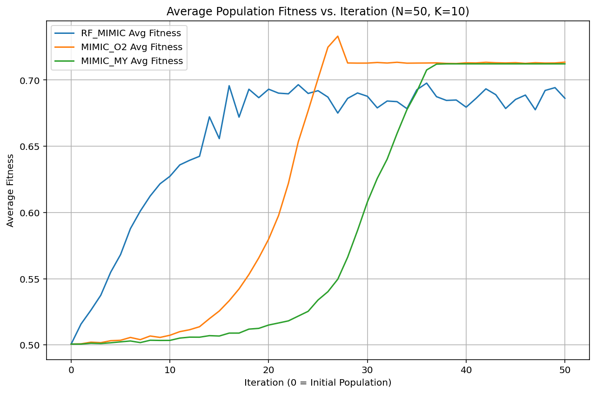

# FEDA Project: A Forest-guided Estimation of Distribution Algorithm for Optimization

This project presents the implementation and evaluation of the **Forest-guided Estimation of Distribution Algorithm (FEDA)**, specifically the RF-MIMIC variant. This algorithm leverages a Random Forest classifier to model the distribution of elite solutions and guide the generation of new candidate solutions for complex optimization problems.

To benchmark performance, we also implement two variants of the MIMIC (Mutual Information Maximizing Input Clustering) algorithm:
- `MIMIC_O2`: uses a dependency tree based on pairwise mutual information.
- `MIMIC_MY`: assumes independence among variables and uses marginal probabilities only.

All algorithms are evaluated on the **NK-Landscape** problem—a tunable benchmark for rugged fitness landscapes.

---

## 🔍 Core Algorithm: RF-MIMIC (Forest-guided EDA)

**Key Concept**: RF-MIMIC evolves a population of candidate solutions by training a Random Forest classifier to differentiate elite (high-performing) solutions from non-elites. It then samples new candidates by probabilistically traversing the trained trees, effectively emulating the characteristics of the elite group.

**Highlights**:
- Uses scikit-learn's `RandomForestClassifier`
- Samples new solutions by biased tree traversal
- Handles sparse data gracefully

📂 File: `feda_algorithm/rf_mimic.py`  
🧱 Class: `RF_MIMIC`

---

## ⚖️ Comparative Algorithms

### MIMIC_O2 (Dependency Tree)
Constructs a tree of dependencies among variables based on mutual information from elite samples.

- Captures pairwise dependencies
- Uses a probabilistic model for sequential sampling
- Includes fallback diversity mechanisms

📂 File: `feda_algorithm/mimic_o2.py`  
🧱 Class: `MIMIC_O2`

### MIMIC_MY (Marginal Probabilities)
A lightweight variant using only independent marginal probabilities.

- Computationally efficient
- Does not model variable dependencies

📂 File: `feda_algorithm/mimic_my.py`  
🧱 Class: `MIMIC_MY`

---

## 📁 Project Structure
```
feda-project/
├── examples/                 # Scripts to run experiments
├── feda_algorithm/          # Optimizers: RF_MIMIC, MIMIC variants
├── problem_definitions/     # NK-Landscape generator
├── utils/                   # Debug logging, helper tools
├── images/                  # Result plots (fitness curves)
├── requirements.txt         # Python dependencies
└── README.md
```

---

## ⚙️ Setup Instructions

### Prerequisites
- Python 3.8+
- `pip`

### Installation
```bash
git clone https://github.com/tortawan/feda-project.git
cd feda-project
python -m venv venv
source venv/bin/activate  # or .\venv\Scripts\activate (Windows)
pip install -r requirements.txt
```

---

## 🚀 Running the Example

Use the included script to compare all algorithms on a defined NK-Landscape:
```bash
python examples/run_feda_nk.py
```

To enable debug logs:
```python
# utils/debugging.py
DEBUG_MODE = True
```

---

## 📊 Result Interpretation
Each algorithm will output:
- Fitness landscape configuration (N, K)
- Per-iteration fitness logs (optional)
- Final solution statistics (fitness, time)
- A plot of average population fitness vs. iteration

Key metrics:
- **Best fitness**: quality of final solution
- **Average fitness**: population-wide convergence trend
- **Execution time**: efficiency

---

## 📈 Experimental Results

### K=1 (Low Interaction)

Simple models excel; RF-MIMIC catches up later.

### K=5 (Moderate Interaction)

MIMIC_O2 is strong early, RF-MIMIC converges well.

### K=10 (High Interaction)

RF-MIMIC outperforms consistently with stronger modeling.

### K=20 (Very High Interaction)

Only RF-MIMIC shows significant progress under high complexity.

---

## 🧠 Key Insights

- For **simple landscapes**, marginal and pairwise models are sufficient.
- For **complex problems**, RF-MIMIC is superior due to its flexible and powerful modeling capabilities.
- RF-MIMIC is computationally more intensive, but yields better fitness and population quality in hard landscapes.

---

## 🏁 Conclusion
This project demonstrates how Random Forests can guide probabilistic model-based optimization algorithms effectively. The **RF-MIMIC** approach adapts well across complexity levels and shows strong potential in high-dimensional, epistatic optimization tasks.

# RF-MIMIC: Forest-Guided Estimation of Distributions Algorithm (FEDA)

## 🚀 Overview

This project implements the **Forest-guided Estimation of Distributions Algorithm (FEDA)**, also known as **RF-MIMIC**. It's an advanced Estimation of Distribution Algorithm (EDA) designed for binary optimization problems. Unlike traditional EDAs that might use simpler probabilistic models, RF-MIMIC leverages the power of **Random Forests** to model the relationships between variables in promising solutions and guide the generation of new candidate solutions.

This implementation is designed to be robust, configurable, and provide insights into the optimization process through detailed fitness tracking and timing information.

---

## 💡 The Novel Idea: Forest-Guided Distribution Estimation

Optimization problems often involve navigating vast search spaces to find the best solution. Estimation of Distribution Algorithms (EDAs) tackle this by iteratively building a probabilistic model of high-performing (elite) solutions and then sampling from this model to generate the next generation of candidates.

**RF-MIMIC takes this a step further with a novel approach to building and sampling from this model:**

1.  **Sophisticated Modeling with Random Forests:**
    * Instead of relying on simpler models that assume variable independence (like some basic EDAs) or pairwise dependencies, RF-MIMIC employs a **Random Forest classifier**.
    * In each generation, this Random Forest is trained to distinguish between **elite** (high-fitness) individuals and **non-elite** individuals from the current population.
    * By doing so, the Random Forest implicitly learns complex, non-linear relationships and important feature interactions that characterize good solutions. This allows for a much richer and more accurate model of the promising regions in the search space.

2.  **Intelligent Sampling from Forest Structures:**
    * The core novelty lies in how new solutions are generated. Instead of just predicting probabilities, RF-MIMIC **traverses the decision trees** within the trained Random Forest to construct new individuals.
    * For each new individual to be generated from a specific tree:
        * It starts at the root of the tree.
        * At each internal node (which represents a gene/feature and a split point), a probabilistic decision is made to go left or right. This decision is influenced by:
            * The proportion of elite samples that went down each path during the RF training.
            * A **`branch_alpha` smoothing factor**: This parameter (default 0.1 in the code) adds a small probability to explore paths less frequented by elites, preventing premature convergence and encouraging diversity. It helps balance exploration and exploitation.
        * The sequence of decisions taken defines the values for certain genes in the new individual.
    * **Leaf Node Refinement:** For genes *not* determined by the path taken to a leaf node (i.e., genes not used in splits along that specific path):
        * Their values are probabilistically set based on the distribution of those gene values among the **elite samples that ended up in that same leaf node** during RF training.
        * If no elites are in that leaf, it falls back to the global elite population statistics, and finally to a 0.5 probability if no elite information is available at all. This ensures that even unspecified genes are set with guidance from good solutions.

**Why is this powerful for a recruiter to see?**

* **Advanced Problem Solving:** Demonstrates an understanding of hybridizing machine learning techniques (Random Forests) with established optimization paradigms (EDAs).
* **Capturing Complexity:** Shows the ability to develop algorithms that can capture intricate dependencies in data, leading to potentially more effective search strategies than simpler methods.
* **Tunable Exploration/Exploitation:** The `branch_alpha` parameter and the RF's nature provide a nuanced way to control the search, which is a critical aspect of optimization.
* **Adaptive Learning:** The model (Random Forest) adapts at each generation to the evolving population of good solutions.

---

## ⚙️ Algorithm Workflow

The RF-MIMIC algorithm proceeds iteratively:

1.  **Initialization:** A random population of binary individuals (solutions) is created.
2.  **Evaluation:** The fitness of each individual in the population is calculated using the problem-specific fitness function.
3.  **Selection:** The population is divided into an 'elite' set (the top N individuals based on fitness) and a 'non-elite' set.
4.  **Model Building (Random Forest Training):**
    * A Random Forest classifier is trained using the elite individuals (labeled as class 1) and non-elite individuals (labeled as class 0).
    * The forest learns to identify patterns and variable combinations characteristic of high-fitness solutions.
5.  **Sampling New Population (Forest-Guided):**
    * A new population is generated by sampling from the trained Random Forest as described in "The Novel Idea" section. Each tree in the forest contributes a portion of the new samples.
    * Fallback mechanisms are in place to handle scenarios with insufficient data for RF training or sampling (e.g., sampling based on elite statistics only, or re-initializing if necessary).
6.  **Update & Repeat:** The new population replaces the old one. The best solution found so far is tracked. The process (steps 2-6) repeats for a defined number of iterations or until a stopping criterion is met.

---

## ✨ Key Features

* Implements the RF-MIMIC / Forest-guided Estimation of Distributions Algorithm (FEDA).
* Utilizes Scikit-learn's `RandomForestClassifier` for robust and efficient model training.
* Specifically designed for **binary-encoded optimization problems**.
* Comprehensive tracking of best fitness per iteration and average population fitness.
* Detailed timing information for iterations and total runtime.
* Includes extensive **edge-case handling** and debugging print statements (`print_debug`) for transparency and robustness (e.g., handling empty elite sets, population size mismatches, num_genes=0).
* Configurable parameters: `population_size`, `max_iterations`, `elite_ratio`, Random Forest parameters (`rf_params`), and the novel `branch_alpha`.

---
