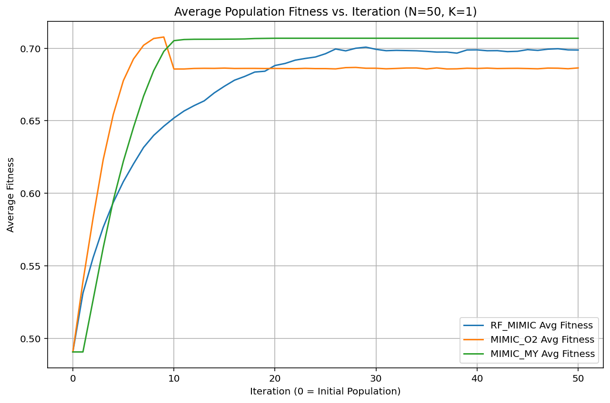
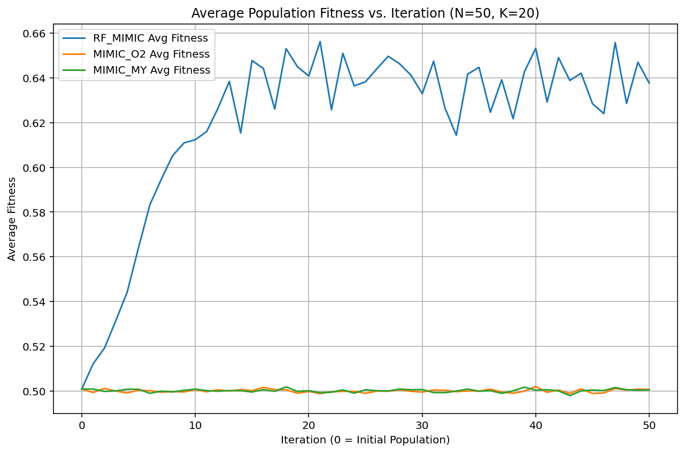

# FEDA Project: A Forest-guided Estimation of Distribution Algorithm for Optimization

This project presents the implementation and evaluation of the **Forest-guided Estimation of Distribution Algorithm (FEDA)**, specifically the RF-MIMIC variant. This novel algorithm, developed in-house, innovatively integrates Random Forests into Estimation of Distribution Algorithms (EDAs), offering a flexible and data-driven way to model complex fitness landscapes. It is especially effective in high-dimensional optimization problems with nonlinear variable dependencies.

To benchmark performance, we also implement two variants of the MIMIC (Mutual Information Maximizing Input Clustering) algorithm:
- `MIMIC_O2`: uses a dependency tree based on pairwise mutual information.
- `MIMIC_MY`: assumes independence among variables and uses marginal probabilities only.

All algorithms are evaluated on the **NK-Landscape** problem—a tunable benchmark for rugged fitness landscapes.

---

## 🔍 Core Algorithm: RF-MIMIC (Forest-guided EDA)

💡 **The Novel Idea: Forest-Guided Distribution Estimation**

Optimization problems often involve navigating vast search spaces to find the best solution. Estimation of Distribution Algorithms (EDAs) tackle this by iteratively building a probabilistic model of high-performing (elite) solutions and then sampling from this model to generate the next generation of candidates.

RF-MIMIC takes this a step further with a novel approach to building and sampling from this model:

### Sophisticated Modeling with Random Forests
- Unlike simpler models that assume variable independence or pairwise dependencies, RF-MIMIC trains a Random Forest classifier to distinguish elite (high-fitness) from non-elite individuals.
- The RF learns complex, non-linear relationships and high-order feature interactions.
- This yields a more expressive and accurate model of promising regions in the search space.

### Intelligent Sampling from Forest Structures
- Instead of sampling directly from probability distributions, RF-MIMIC traverses each tree in the trained Random Forest to construct new individuals.
- Traversal starts at the root, and at each decision node:
  - A probabilistic decision is made to go left or right, influenced by the elite proportion that took each path during training.
  - A smoothing parameter `branch_alpha` (default: 0.1) encourages exploration by assigning small probabilities to less traveled paths.
- The sequence of traversal decisions determines values for some genes.
- Remaining genes (not defined by the tree path) are filled using:
  - Statistics from elite samples in the reached leaf node
  - Global elite statistics, or uniform sampling as fallback

### ⚙️ Algorithm Workflow
1. **Initialization**: Random binary population is created
2. **Evaluation**: Each individual's fitness is evaluated
3. **Selection**: Elite (top-N) individuals are selected
4. **Model Building**: A Random Forest is trained using elite vs. non-elite labels
5. **Sampling**: New population is sampled via forest traversal, with fallback logic
6. **Update**: Repeat steps 2-6 for several iterations or until convergence

### ✨ Key Features
- Implements the RF-MIMIC / Forest-guided Estimation of Distributions Algorithm (FEDA)
- Uses scikit-learn's RandomForestClassifier for robust modeling
- Designed for binary-encoded optimization problems
- Tracks best fitness and average fitness across iterations
- Logs timing per iteration and total runtime
- Handles edge cases like empty populations or featureless problems
- Configurable: `population_size`, `max_iterations`, `elite_ratio`, `rf_params`, and `branch_alpha`

**Key Concept**: RF-MIMIC evolves a population of candidate solutions by training a Random Forest classifier to differentiate elite (high-performing) solutions from non-elites. It then samples new candidates by probabilistically traversing the trained trees, effectively emulating the characteristics of the elite group.

This is the **first known implementation** of a forest-guided probabilistic model within the EDA family. Unlike traditional EDAs that assume independence or pairwise dependencies, RF-MIMIC uses the nonparametric structure of decision trees to learn arbitrary, high-order interactions. The biased traversal algorithm samples along learned paths in the forest, while unresolved features are backfilled using adaptive statistics from elite solutions.

**Highlights**:
- Introduces a new method: decision-tree-guided probabilistic sampling
- Models nonlinear, hierarchical dependencies in high-dimensional spaces
- Resilient to noisy fitness landscapes and limited elite data
- Uses scikit-learn's `RandomForestClassifier`
- Handles sparse or degenerate cases with elegant fallbacks

📂 File: `feda_algorithm/rf_mimic.py`  
🧱 Class: `RF_MIMIC`

---

## ⚖️ Comparative Algorithms

### MIMIC_O2 (Dependency Tree)
Constructs a tree of dependencies among variables based on mutual information from elite samples.

- Captures pairwise dependencies
- Uses a probabilistic model for sequential sampling
- Includes fallback diversity mechanisms

📂 File: `feda_algorithm/mimic_o2.py`  
🧱 Class: `MIMIC_O2`

### MIMIC_MY (Marginal Probabilities)
A lightweight variant using only independent marginal probabilities.

- Computationally efficient
- Does not model variable dependencies

📂 File: `feda_algorithm/mimic_my.py`  
🧱 Class: `MIMIC_MY`

---

## 📁 Project Structure
```
feda-project/
├── examples/                 # Scripts to run experiments
├── feda_algorithm/          # Optimizers: RF_MIMIC, MIMIC variants
├── problem_definitions/     # NK-Landscape generator
├── utils/                   # Debug logging, helper tools
├── images/                  # Result plots (fitness curves)
├── requirements.txt         # Python dependencies
└── README.md
```

---

## ⚙️ Setup Instructions

### Prerequisites
- Python 3.8+
- `pip`

### Installation
```bash
git clone https://github.com/tortawan/feda-project.git
cd feda-project
python -m venv venv
source venv/bin/activate  # or .\venv\Scripts\activate (Windows)
pip install -r requirements.txt
```

---

## 🚀 Running the Example

Use the included script to compare all algorithms on a defined NK-Landscape:
```bash
python examples/run_feda_nk.py
```

To enable debug logs:
```python
# utils/debugging.py
DEBUG_MODE = True
```

---

## 📊 Result Interpretation
Each algorithm will output:
- Fitness landscape configuration (N, K)
- Per-iteration fitness logs (optional)
- Final solution statistics (fitness, time)
- A plot of average population fitness vs. iteration

Key metrics:
- **Best fitness**: quality of final solution
- **Average fitness**: population-wide convergence trend
- **Execution time**: efficiency

---

## 📈 Experimental Results

### K=1 (Low Interaction)

Simple models excel; RF-MIMIC catches up later.

### K=5 (Moderate Interaction)

MIMIC_O2 is strong early, RF-MIMIC converges well.

### K=10 (High Interaction)

RF-MIMIC outperforms consistently with stronger modeling.

### K=20 (Very High Interaction)

Only RF-MIMIC shows significant progress under high complexity.

---

## 🧠 Key Insights

- For **simple landscapes**, marginal and pairwise models are sufficient.
- For **complex problems**, RF-MIMIC is superior due to its flexible and powerful modeling capabilities.
- RF-MIMIC is computationally more intensive, but yields better fitness and population quality in hard landscapes.

---

## 🏁 Conclusion
This project demonstrates how Random Forests can guide probabilistic model-based optimization algorithms effectively. The **RF-MIMIC** approach adapts well across complexity levels and shows strong potential in high-dimensional, epistatic optimization tasks.


